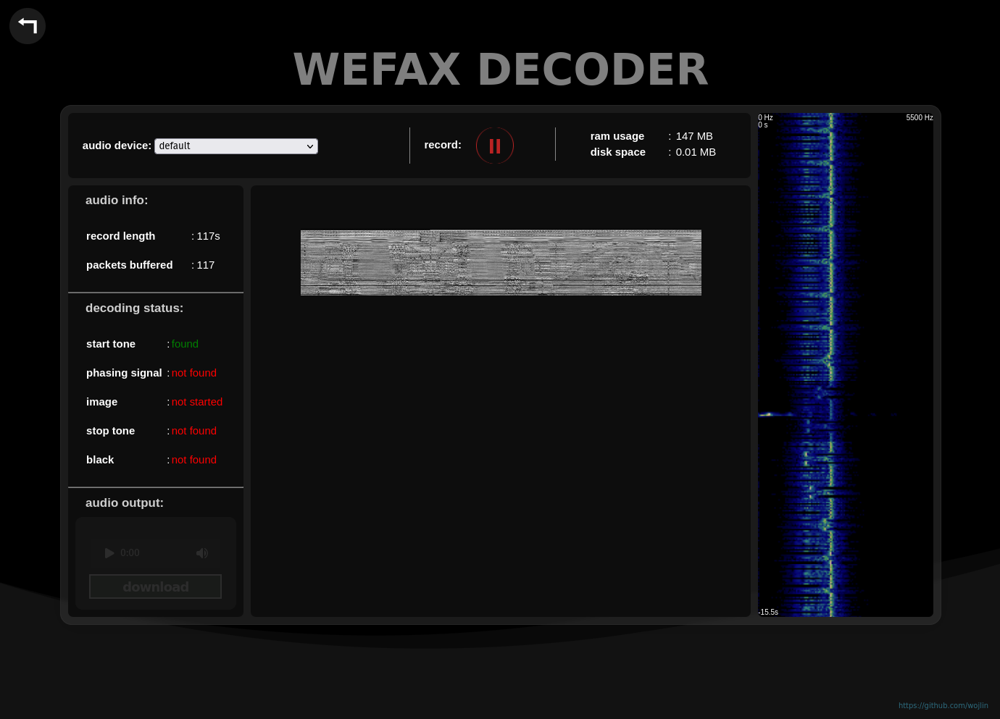
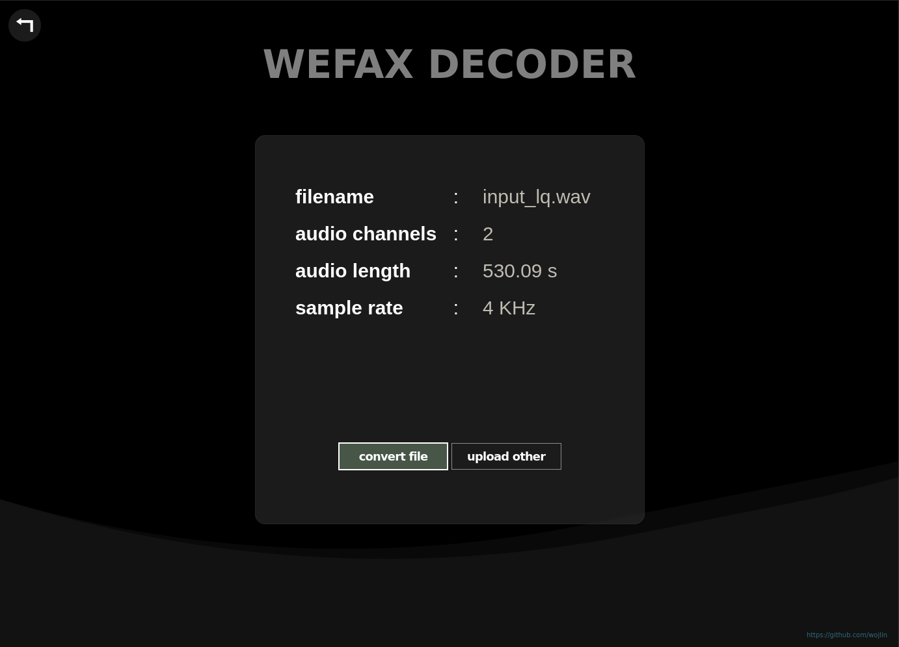
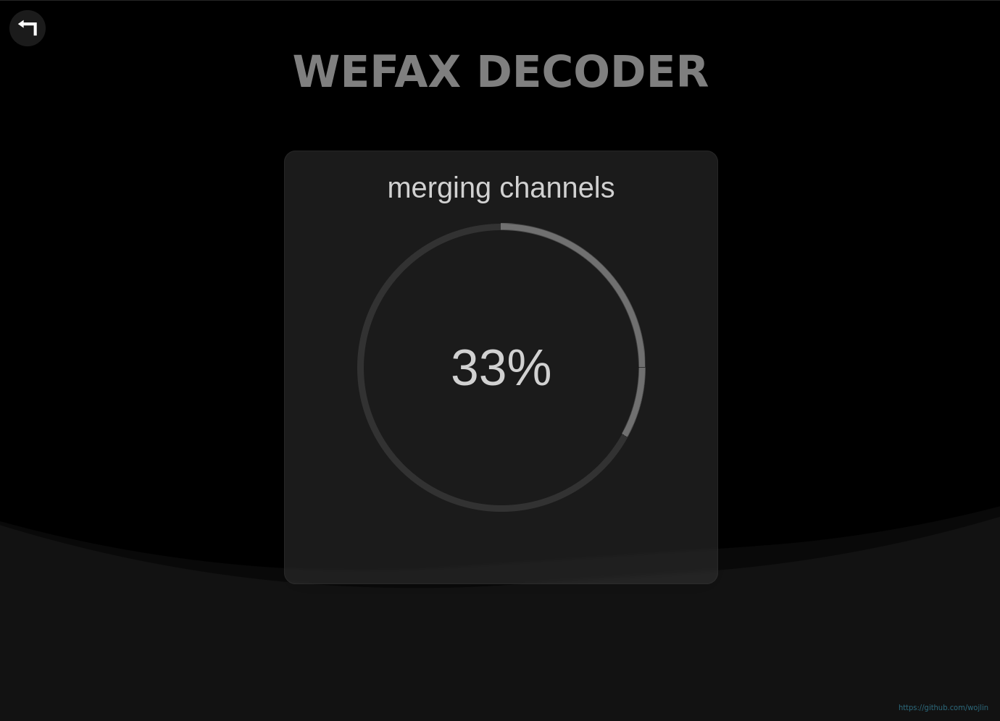
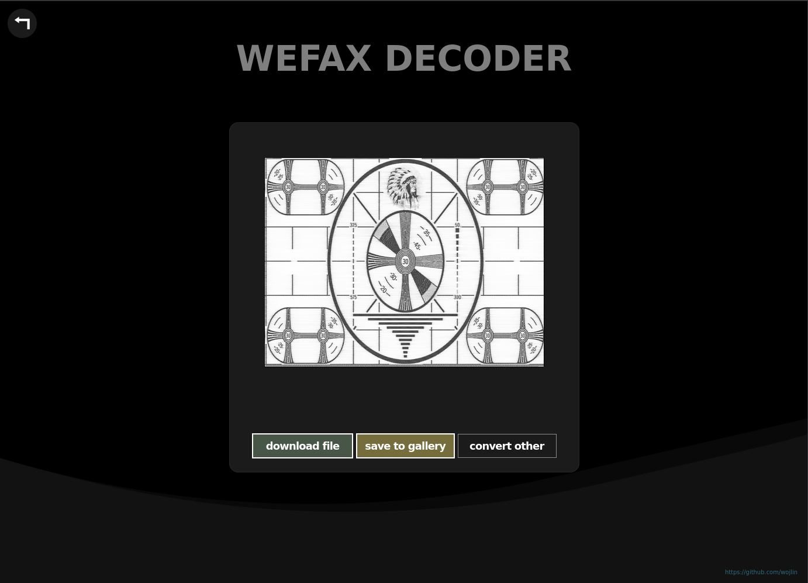
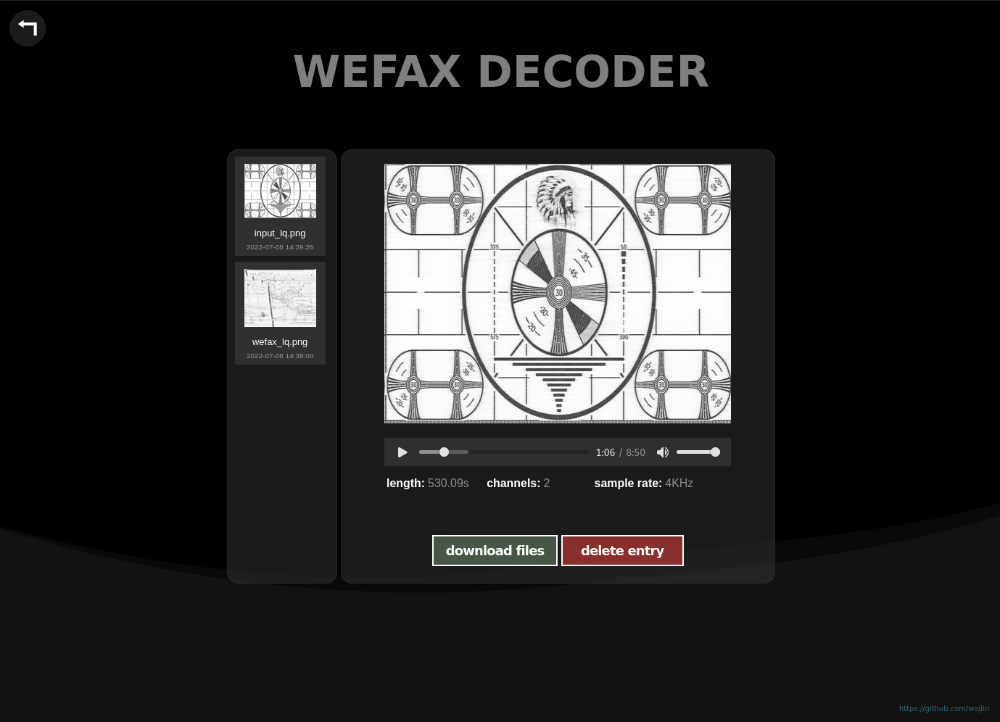

# WIP - WORK IN PROGRESS

### description:

tool for decoding and processing wefax


<p float="left">
  
   
  
</p>
<p float="left">
  
  
</p>


### theory:
WEFAX (Also known as Weatherfax, HF-FAX, Radiofax, and Weather Facsimile) is a slow scan analog image transmission mode used for the transmission of weather charts and meteorological reports

WEFAX's format is a derivative of the Automatic Picture Transmission (APT) originally developed for transmission from the polar satellites of the USA.

WEFAX has 60, 90, 100, 120, 180 and 240 LPM (Lines per minute) speeds, and two IOC (Index of Cooperation) modes, IOC 576 and IOC 288. Most weather forecasts are sent in IOC 576. 

<table cellspacing="0" cellpadding="5" border="1" align="center"><tbody><tr><th> Signal
</th>
<th> Duration
</th>
<th> IOC576
</th>
<th> IOC288
</th>
<th> Remarks
</th></tr><tr><td> Start tone
</td>
<td> 5s
</td>
<td> 300&nbsp;<span class="mw-lingo-tooltip " data-hasqtip="true"><span class="mw-lingo-tooltip-abbr">Hz</span></span>
</td>
<td> 675&nbsp;<span class="mw-lingo-tooltip " data-hasqtip="true"><span class="mw-lingo-tooltip-abbr">Hz</span></span>
</td>
<td> 200&nbsp;<span class="mw-lingo-tooltip " data-hasqtip="true"><span class="mw-lingo-tooltip-abbr">Hz</span></span> for colour fax modes.
</td></tr><tr><td> Phasing signal
</td>
<td> 30s
</td>
<td>
</td>
<td>
</td>
<td> Black line interrupted by a white pulse.
</td></tr><tr><td> Image
</td>
<td> Variable
</td>
<td> 1200 lines
</td>
<td> 600 lines
</td>
<td> At 120 lpm.
</td></tr><tr><td> Stop tone
</td>
<td> 5s
</td>
<td> 450&nbsp;<span class="mw-lingo-tooltip " data-hasqtip="true"><span class="mw-lingo-tooltip-abbr">Hz</span></span>
</td>
<td> 450&nbsp;<span class="mw-lingo-tooltip " data-hasqtip="true"><span class="mw-lingo-tooltip-abbr">Hz</span></span>
</td>
<td>
</td></tr><tr><td> Black
</td>
<td> 10s
</td>
<td>
</td>
<td>
</td>
<td>
</td></tr></tbody></table>


* Modulation: FSK (F3C)
* Emission code: 3K00F3C
* FSK Carrier: 1900 Hz
* Shift: White +400 Hz, Black -400 Hz
* Scan line frequency: 2 lines per second (120 lines per minute)
* Scan line stability: Within 5 parts in 1,000,000
* Index of co-operation: 576
* Scanning line density: 3.8 lines per millimetre (96 lines per inch)
* Picture format: Comprises start, phasing, picture and stop sequence as detailed below
* Start signal: Carrier modulated for 5 seconds by alternate Black and White at a rate of 300 Hz
* Phasing signal: 60 scan lines, each scan line comprising White level for 25 milliseconds followed Black level for 475 milliseconds
* Picture signal: Line to start with 25 milliseconds White level, followed by one line of picture content uniformly occupying the remaining 475 milliseconds. This format to continue until entire picture content has been transmitted
* Stop signal: Carrier modulated for 5 seconds by alternate Black and White at a rate of 450 Hz, followed by 10 seconds of Black level
* SSB Receiver tuning frequency: (for a standard WMO facsimile decoder) 1.9 kHz below the published transmit frequencies
* Tuning Tone: Most charts are preceded by 60 seconds of 'tuning tone' (white signal) to allow receivers to automatically tune and capture the chart.
* The 'tuning tone' precedes the scheduled transmission time of a chart.
* Some charts could not be preceded by 'tuning tone' as there is insufficient idle period preceding. To automatically capture these charts, set your receiver to wake up 2-3 minutes earlier and tune-in on the tail-end to the previous transmission.


### installation:
```
git clone https://github.com/wojlin/WEFAX.git
cd WEFAX
python3 -m venv .venv
source .venv/bin/activate
pip install -r requirements.txt
```

### usage:
```
python3 main.py
```


### TODO:
- f̶i̶x̶ ̶U̶I̶ ̶b̶u̶g̶ ̶w̶h̶e̶n̶ ̶f̶i̶l̶e̶n̶a̶m̶e̶ ̶i̶s̶ ̶t̶o̶o̶ ̶l̶o̶n̶g̶
- f̶i̶x̶ ̶U̶I̶ ̶b̶u̶g̶ ̶w̶h̶e̶n̶ ̶i̶m̶a̶g̶e̶ ̶f̶r̶a̶m̶e̶ ̶h̶e̶i̶g̶h̶t̶ ̶i̶s̶ ̶t̶o̶o̶ ̶b̶i̶g̶ ̶i̶n̶ ̶i̶m̶a̶g̶e̶ ̶p̶r̶e̶v̶i̶e̶w̶
- f̶i̶x̶ ̶U̶I̶ ̶b̶u̶g̶ ̶w̶h̶e̶n̶ ̶i̶m̶a̶g̶e̶ ̶f̶r̶a̶m̶e̶ ̶h̶e̶i̶g̶h̶t̶ ̶i̶s̶ ̶t̶o̶o̶ ̶b̶i̶g̶ ̶i̶n̶ ̶g̶a̶l̶l̶e̶r̶y̶ 
- f̶i̶x̶ ̶c̶o̶n̶v̶e̶r̶t̶ ̶b̶u̶g̶ ̶w̶h̶e̶n̶ ̶w̶a̶v̶ ̶f̶i̶l̶e̶s̶ ̶h̶a̶v̶e̶ ̶l̶o̶w̶ ̶s̶p̶i̶k̶e̶s̶ ̶(̶c̶u̶t̶ ̶u̶n̶u̶s̶e̶d̶ ̶f̶r̶e̶q̶u̶e̶n̶c̶i̶e̶s̶ ̶b̶e̶f̶o̶r̶e̶ ̶h̶i̶l̶b̶e̶r̶t̶ ̶t̶r̶a̶n̶s̶f̶o̶r̶m̶)̶
- f̶i̶x̶ ̶m̶e̶m̶o̶r̶y̶ ̶a̶l̶l̶o̶c̶a̶t̶i̶o̶n̶ ̶p̶r̶o̶b̶l̶e̶m̶
- m̶o̶r̶e̶ ̶r̶e̶s̶p̶o̶n̶s̶i̶v̶e̶ ̶p̶r̶o̶g̶r̶e̶s̶s̶ ̶b̶a̶r̶ 
- f̶i̶x̶ ̶d̶e̶m̶o̶d̶u̶l̶a̶t̶i̶o̶n̶ ̶p̶r̶o̶b̶l̶e̶m̶ ̶i̶n̶ ̶l̶i̶v̶e̶ ̶d̶e̶c̶o̶d̶i̶n̶g̶ 
- create doc strings of functions (wip)
- fix true audio length bug
- optimize received frames byte size
- detect phasing signal in live decoding
- detect end tone in live decoding
- generate image from stripes in live decoding
- add option "save to gallery" in live decoding
- more config options
- implement notch filter in file decoding
- generate proper requirements file
- finish live decoding
- implement more test cases
- add alerts and bugs report


### BUGS AND PROBLEMS:

pyaudio install error:
https://stackoverflow.com/questions/20023131/cannot-install-pyaudio-gcc-error

https://gist.github.com/diegopacheco/d5d4507988eff995da297344751b095e

*installing py audio globally instead of pip may help*